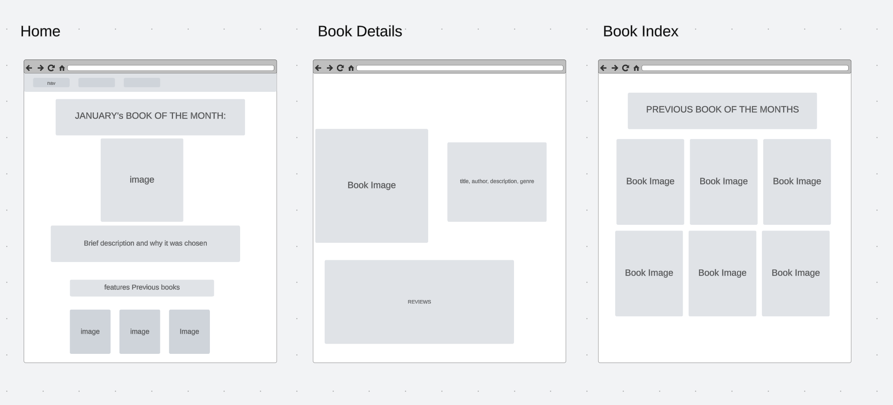

# BGR MEN STACK!

[BGR Site](https://bgr-e4f832504566.herokuapp.com/)

## Technology Used:

- HTML
- CSS
- JavaScript
- ejs
- Heroku
- Express
- Mongoose

## Route Table

| URI                     | Rest    | HTTP Verb | CRUD   | View             | Complete |
| ----------------------- | ------- | --------- | ------ | ---------------- | -------- |
| /                       |         | GET       | Read   | home.ejs         | Yes      |
| /books                  | index   | GET       | Read   | book-index.ejs   | Yes      |
| /books/:id              | show    | GET       | Read   | book-details.ejs | Yes      |
| /books/new              | new     | GET       |        | new-book.ejs     | Yes      |
| /books                  | create  | POST      | Create |                  | Yes      |
| /books/:id/edit         | edit    | GET       | Read   | edit-book        | Yes      |
| /books/:id              | update  | PUT       | Update |                  | Yes      |
| /books/:id              | destroy | DELETE    | Delete |                  | Yes      |
| /reviews/               | index   | GET       | Read   | review-index     | Yes      |
| /reviews/:id            | show    | GET       | Read   | review-details   | Yes      |
| /reviews/new/:bookId    | new     | GET       | Read   | new-reviews      | Yes      |
| /reviews/create/:bookId | create  | POST      | Create |                  | Yes      |
| /reviews/:id            | destroy | DELETE    | Delete |                  | Yes      |
| /seed                   |         | GET       | D/C    |                  | Yes      |
| /about                  |         |           |        | about.ejs        | Yes      |
| /\*                     |         |           |        | 404.ejs          | Yes      |

## Wire Frames

## User Stories:

- As a an avid reader, I want an easy to navigate website that truly highlights books, so that I can be excited to join a book club and learn about new books.

- As Software Engineering student, I want to see an example of a good MEN stack website, so that I have inspiration for my Unit 2 project.

- As a prospective customer, I want to see how Jahdai builds a website from scratch and if she can meet all my goals in a timely fashion so that I can launch a new site soon

- As Jahdai's teacher, I want to see how well she grasps MEN especially routes, ejs, and mongoose so that I can evaluate her performance in the class and give her constructive feedback.

## Major Hurdles:

- I faced challenged with styling, primarily css grid. Although I finally found a resource that really helped me understand how to use css grid, I lost time that couldve been spent styling the app better
- My reviews would Yest show up under the book details and I spent a lot of time trying to figure out why. I combed through my code, compared it to past projects etc. It turns out I was missing a semi colon in my middleware section of my server.js. Alot of time wasted, however it really forced me to understand how a small oversite can really impact an app

## Next Steps:

- I want to spend more time on the styling and visual of the site. The structure is there but its Yest the best website to look at.
- Limit the amount of reviews shown on a details page, allow users to read additional reviews for a book on aYesther page
